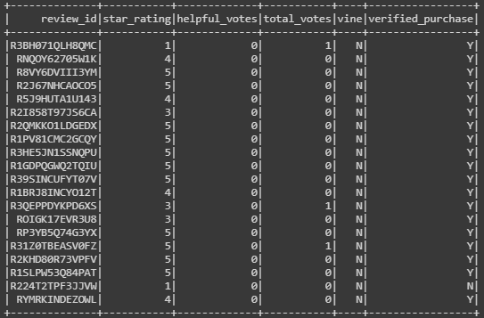

# Amazon Vine Analysis Using PySpark

## Overview 
The purpose of this analysis is to study one of Amazon's order category dataset and use PySpark to perform the ETL process to an AWS RDS instance, and load the transformed data into pgAdmin. The data is then used to determine if there is any bias toward favourable reviews from Vine members when compared to non-Vine reviews.

Resources
Google Colab Notebooks
VS Code v1.52.0
PostgresSQL v12
PgAdmin v4.24
Amazon Cloud (AWS) - RDS and S3
Automotive Review Data

## Results

- The raw dataset of reviews downloaded from Amazon S3 service for the category 'Video Games'

- The raw dataset was next filtered to retail the only columns related to the Vine Voice Program. 

- The Vice Voice Program Data was further analysed to remove those reviews which did not get many votes from Amazon users (Threshold: 20 votes). This was done to ensure that only those reviews will be analyses that the community found helpful. 

- To find helpful reviews the data was filtered to obtain only those rows where the ratio of helpful votes to that of total votes was greater than 50%. 

- The totals of Vine and Non-Vine reviews is as follows:

- The summary of the analysis is as follows:

    - Total of Vine reviews - 98

    - Total of non Vine reviews - 41535

    - Total 5-Star Vine reviews - 49

    - Total 5-star Non-Vine reviews - 16190

    - % 5-Star Vine vs Non-Vine Reviews - 50% vs 39%

## Summary
There is an 11% difference noticed when comparing vine reviewers with non-vine reviewers (5-Star ratings), thereby indicating a slight bias of positive reviews from Vine Program reviewers.

## Additional Analysis
 - Analyse more categories of products from Amazon to verify if the above trend is consistent across more categories. 
 - Analysis categories where Vine reviews make up the majority of reviews. 

